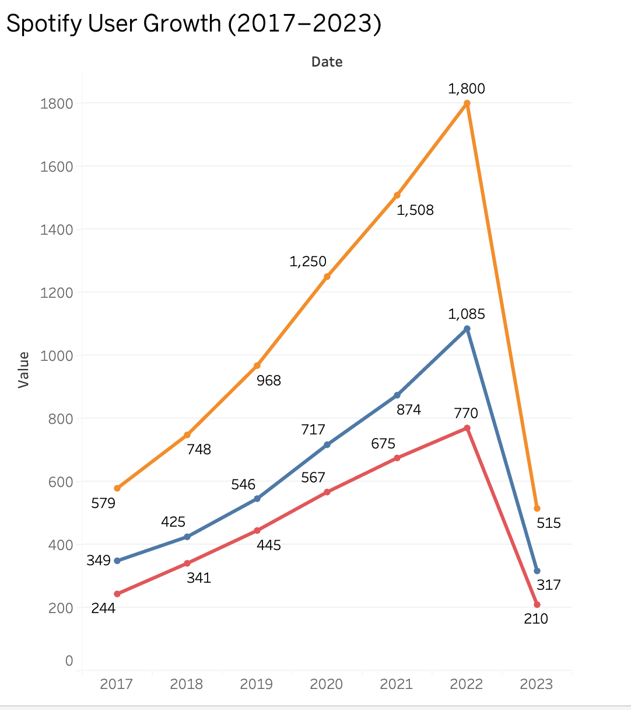
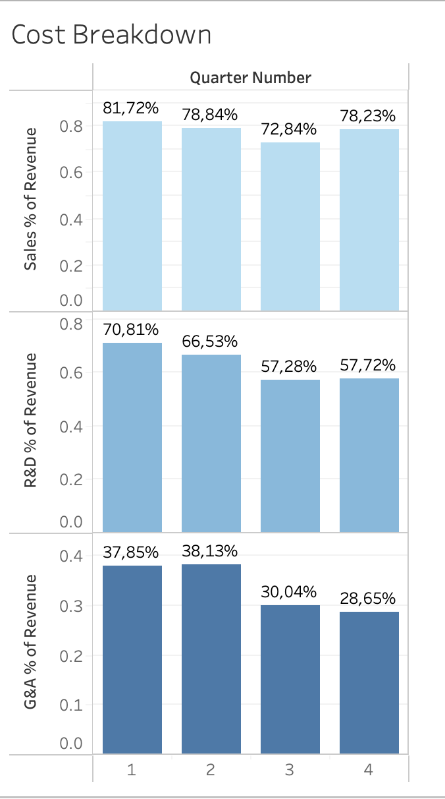

# Spotify Tableau Project: Revenue, Costs, and User Growth Analysis

## 📦 Description

A Tableau project analyzing Spotify's revenue, user growth, and cost structure from 2017–2023. Includes dashboards, KPIs, and stakeholder insights for strategy, revenue, and operations.

---

## 📋 Features

- 📈 Revenue breakdown: Total, Premium vs. Ad Revenue
- 👥 User growth analysis: MAUs, Premium vs. Ad
- 💰 ARPU and monetization trends
- 💡 Operational cost efficiency insights
- 📊 Clean and interactive Tableau dashboards
- 🧠 Executive summary with recommendations

---

## 🗂️ Repository Structure

```
spotify-tableau-project/
├── README.md                  # Project summary and instructions
├── Spotify Dataset.xlsx       # Cleaned dataset with calculated metrics
├── Tableau Dashboards/
│   ├── Revenue & Profit.twbx
│   ├── User Growth.twbx
│   └── Cost Structure.twbx
├── Screenshots/
│   ├── revenue_chart.png
│   ├── user_growth.png
│   └── cost_analysis.png
└── Report.pdf                 # Final report with key insights
```

## 📊 Project Summary

This project simulates a Spotify BI analyst sprint. Based on 17 key metrics from 2017–2023, dashboards were built for three internal stakeholders:

- **Sarah (Strategy)** – user growth trends
- **Mark (Revenue)** – revenue streams & ARPU
- **Olivia (Operations)** – cost efficiency & margin insights

The dashboards are designed to be interactive, business-focused, and presentation-ready.

---

## 🔗 Live Tableau Preview (optional)

...will be added soon

---

# Spotify Tableau Project

## 📄 Introduction

This project simulates a real-world BI analyst task at **Spotify**, focusing on financial and user data from **2017 to 2023**. You will analyze Spotify's **revenue streams**, **cost structure**, and **user engagement** through Tableau visualizations to deliver actionable insights to key stakeholders.

---

## 🔢 Dataset Overview

The dataset includes 17+ columns such as:

- `Date`, `Quater`, `Quarter Number`
- `Total Revenue`, `Cost of Revenue`, `Gross Profit`
- `Premium Revenue`, `Premium Cost Revenue`, `Premium Gross Profit`
- `Ad Revenue`, `Ad Cost of Revenue`, `Ad Gross Profit`
- `MAUs`, `Premium MAUs`, `Ad MAUs`
- `Premium ARPU`
- `Sales and Marketing Cost`, `Research and Development Cost`, `General and Administrative Cost`


---

## 🚀 Project Phases

### Phase 1: Planning and KPI Definition

1. **Dataset Exploration**

   - Explore Google Sheets or Excel dataset
   - Review revenue vs. cost trends, premium vs. ad segmentation

## Data Preparation

### Spotify Project Data (`New coloumns Spotify Project `)   
📥 [Download cleaned CSV]([New coloumns Spotify Project .xlsx)](https://github.com/AlexandraProt/spotify-tableau-project/blob/main/New%20coloumns%20Spotify%20Project%20.xlsx)

2. **Define Stakeholder Goals**

| Stakeholder         | Goals                                       |
| ------------------- | ------------------------------------------- |
| Sarah (Strategy)    | User growth insights by type                |
| Mark (Revenue)      | Revenue breakdown and ARPU trend            |
| Olivia (Operations) | Cost structure & optimization opportunities |

3. **Key KPIs**

- Revenue Growth Rate
- Premium vs Ad Revenue Share
- ARPU Dynamics
- Gross Margin (Total, Premium, Ad)
- Cost % of Revenue (S&M, R&D, G&A)
- Premium MAU Share

4. **Plan Visualizations**

- Line Charts (Revenue, ARPU, User Growth)
- Bar Charts (Cost Breakdown)
- Pie / Area Charts (User Segmentation)

---

Вот финальная версия секции **Dashboards Overview** для `README.md` в Markdown формате с учётом всех 11 визуализаций (файлов):

---

### 📊 Dashboards Overview

This project includes three dashboards analyzing Spotify's business performance from 2017 to 2023. Each dashboard provides visual insights for a specific stakeholder: Strategy, Revenue, or Operations.

---

#### ✅ Dashboard 1: Revenue & Profit Overview

Focus: Revenue growth trends, premium vs ad monetization, and profitability over time.

| Chart | Description |
|-------|-------------|
|  | **Total Revenue over Time (Yearly)** – Displays annual growth of total revenue from 2017 to 2023. |
|  | **Total Revenue by Quarter** – Compares revenue performance across Q1–Q4. |
|  | **Total Gross Margin by Quarter** – Highlights average gross margin fluctuations per quarter. |
|  | **Premium Revenue vs Ad Revenue (Dual-Axis)** – Compares revenue streams side-by-side across all quarters. |

---

#### ✅ Dashboard 2: User Growth & Segmentation

Focus: User acquisition, segmentation by subscription type, and monetization.

| Chart | Description |
|-------|-------------|
|  | **User Growth Over Time** – Shows growth of total MAUs, Premium MAUs, and Ad MAUs. |
|  | **MAU Share (Stacked Area Chart)** – Visualizes Premium vs Ad user share per quarter. |
|  | **Premium ARPU Trend** – Tracks average revenue per Premium user over time. |

---

#### ✅ Dashboard 3: Cost & Efficiency

Focus: Operational cost breakdown, departmental spending, and margin efficiency.

| Chart | Description |
|-------|-------------|
|  | **Cost % of Revenue (Bar Chart)** – Tracks spending in Sales, R&D, and Admin as a share of revenue. |
|  | **Cost Distribution (Donut Chart)** – Visual comparison of Sales, R&D, and Admin costs. |
|  | **Gross Margin: Premium vs Ad** – Tracks profitability by revenue stream over time. |
|  | **Cost Breakdown by Quarter** – Compares how costs shift between Q1, Q2, Q3, and Q4. |

---

## 📚 Final Report 

- **Revenue** is steadily growing with temporary drops likely caused by seasonality or global events.
- **ARPU** remains relatively stable with slight upward trend.
- **Premium segment** is more profitable than Ad-based.
- **Marketing costs** appear to grow — consider A/B testing and channel attribution for efficiency.
- **Growth in Premium MAU share** indicates strong user retention.

---


